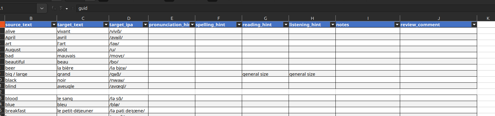

# How to contribute to AnkiLangs

If you are technically experienced you can also check out the [development documentation](docs/development.md).


## Error corrections

For example: The "Portuguese 625 words" deck contains a typo → edit `src/data/625_words-base-pt_pt.csv`.

CSV files can be imported into Microsoft Excel or LibreOffice Calc in order to edit them.
They can be found under `src/data/`.

See [below](#send-a-pull-request) for how to send your changes back to AnkiLangs.


## Contributing audio

For example: A German audio recording for the word "Flugzeug" is incorrect →
replace the file `src/media/audio/de_DE/al_de_de_the_plane.mp3`

If you want to add or modify media files (e.g. audio)
you must do so in the `src/media/` directory.


### Audio: Physical Setup

* Use the best microphone you have available
* Find a noise-free environment


### Audio: Recording

* Record a bit of silence at the beginning (so we can remove background noise)
* Speak slowly, but pronounce words naturally.
* Leave breaks between words and sentences to help us cut the audio automatically etc.


### Audio: Mastering

* Try to preserve the quality of the microphone output signal
* If possible, aim for:
  * 44100 Hz sample rate
  * 16 bit bit depth
  * Audio saved as FLAC, WAV, OGG Vorbis, MP3 (in that order of preference)

For audio recordings we can use a file sharing service instead of PRs.
Please get in touch via [e-mail](mailto:info@ankilangs.org).


## Systematic Deck Review

If you want to do a comprehensive review of an entire deck (e.g., to check
translations, IPA transcriptions, and audio quality), we provide a streamlined
workflow that generates a spreadsheet and combined audio file.

**Example: Reviewing the EN → FR deck**

```bash
git clone https://github.com/ankilangs/ankilangs.git
cd ankilangs
uv run al-tools export-review -s en_us -t fr_fr
libreoffice build/review/review_en_us_to_fr_fr.xlsx &
vlc build/review/review_en_us_to_fr_fr.mp3
```

⚠️ **Note:** The above commands may only work smoothly on Linux and require some
technical expertise if issues arise. If you encounter problems or prefer not to
deal with the technical setup, please don't hesitate to contact us at
[info@ankilangs.org](mailto:info@ankilangs.org). We can send you the Excel file
and MP3 file directly so you can perform the review without executing these
commands.

This generates a spreadsheet with all vocabulary entries as follows, as well as
a combined audio file.



You can then:
- **Correct any translation mistakes** directly in the spreadsheet
- **Fix IPA transcription errors**
- **Comment on audio quality issues** in the `review_comment` column

The audio file plays all entries in the same order as the spreadsheet, with:
- 300ms breaks between words
- 5-second breaks every 10 words
- Total duration: ~18 minutes for a 625-word deck

When you are done you can send the edited spreadsheet via email
[info@ankilangs.org](mailto:info@ankilangs.org) or submit a pull request (see
below), which won't be merged as it is but allows us to extract and process the
spreadsheet.

**Partial reviews are welcome!** Even if you only review part of a deck, that's
helpful. We can find someone else to continue where you left off.


## Send a Pull Request

In order for you modification to become part of the project you must send a PR (pull request) as documented
[here](https://docs.github.com/en/pull-requests/collaborating-with-pull-requests/proposing-changes-to-your-work-with-pull-requests/creating-a-pull-request-from-a-fork).

If you have no experience whatsoever with Git, GitHub, pull requests etc.
you can send your edits to the CSV files via [e-mail](mailto:info@ankilangs.org).


## Licensing

Any content you contribute needs to be licensed under a compatible open source license,
for instance [CC BY-SA 4.0](https://creativecommons.org/licenses/by-sa/4.0/deed.en).
You need to either be the original author of the content or clearly communicate the original source and licensing terms.
Copyrighted content cannot be accepted.

Not sure what all of that means? Have a look at https://choosealicense.com/
