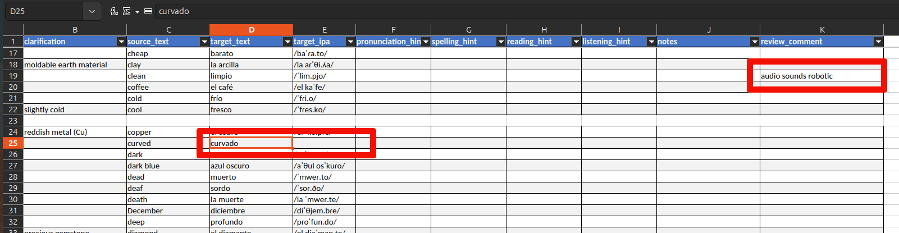

# How to contribute to AnkiLangs

Thank you for your interest in improving AnkiLangs! This guide is for non-technical contributors who want to help improve translations, audio, and other content.

If you're comfortable with technical tools and want to set up the full development environment, see the [technical documentation](docs/development.md).

## Quick Navigation

- [Error Corrections](#error-corrections) - Fix typos and translation mistakes
- [Contributing Audio](#contributing-audio) - Record or improve audio files
- [Systematic Deck Review](#systematic-deck-review) - Review entire decks comprehensively
- [Learning Hints](#learning-hints) - Add hints for ambiguous words
- [Sending Your Changes](#send-a-pull-request) - How to submit your contributions

Nomenclature:
* **Source language:** The (native) language that the learner already speaks (fluently).
* **Target language:** The new language that the learner wants to learn.
* If you see "EN to FR" or "from EN to FR" then EN (English) is the source language and FR (French) is the target language.

## File Structure (What You Need to Know)

AnkiLangs stores all language data in structured files. Here's what matters for contributors:

```
ankilangs/
├── src/
│   ├── data/           ← CSV files with all vocabulary and translations
│   └── media/
│       └── audio/      ← Audio recordings (MP3 files)
└── docs/               ← Documentation
```

**What about the rest?** The project contains other directories (`build/`, `recipes/`, `al_tools/`, etc.) that handle technical aspects like building Anki decks and processing data. You don't need to understand or modify these. If you're curious about the complete structure, check the [technical documentation](docs/development.md#project-structure).

## Error Corrections

**Example:** The Portuguese 625 words deck contains a typo.

**How to fix it:**

1. Find the CSV file in `src/data/` (e.g., `625_words-base-pt_pt.csv`)
2. Open it in Microsoft Excel, LibreOffice Calc, or any spreadsheet program
3. Make your correction
4. [Send your changes](#send-a-pull-request)

**CSV Structure:** Each CSV file contains columns for the English word, translation, pronunciation (IPA), audio filename, and various [learning hints](#learning-hints).

## Contributing Audio

**Example:** A German audio recording for "Flugzeug" sounds unnatural.

**How to fix it:**

Replace the file `src/media/audio/de_DE/al_de_de_the_plane.mp3` with your improved recording.

### Audio Recording Guidelines

#### Physical Setup
- Use the best microphone available
- Find a quiet, noise-free environment

#### Recording
- Record a bit of silence at the beginning (helps remove background noise)
- Speak slowly but pronounce words naturally
- Leave breaks between words to help with audio editing

#### File Format
If possible, aim for:
- 44100 Hz sample rate
- 16 bit bit depth
- Format preference: FLAC > WAV > OGG Vorbis > MP3

**Note:** For audio recordings, we can use a file sharing service instead of pull requests. Please contact us at [info@ankilangs.org](mailto:info@ankilangs.org).

## Systematic Deck Review

Want to review an entire deck? We'll send you an **Excel spreadsheet** and an **audio file** with all words in order.

**Contact [info@ankilangs.org](mailto:info@ankilangs.org)** and tell us which deck (e.g., "EN → FR 625 words"). If you're comfortable with technical setup, you can also [generate these files yourself](docs/development.md#systematic-deck-review).

### What You Get

1. **Excel Spreadsheet (.xlsx)** — All vocabulary in a single table. **Edit it directly** — we have tooling to import your changes back.
2. **Audio File (.mp3)** — All words played in spreadsheet order (300ms between words, 5s pause every 10 words, ~18 min for 625 words).

### Review Workflow

1. Open the spreadsheet and play the audio file side by side
2. Follow along row by row, checking translations and pronunciation
3. **Fix things directly**: wrong translation? Fix it in the cell. Wrong IPA? Fix it. Missing hint? Add it.
4. **Can't fix it in the spreadsheet?** (e.g., audio sounds wrong, unclear pronunciation) → describe the issue in the `review_comment` column

### Spreadsheet Columns


_In the example above the reviewer corrected the translation of "curved", deleted the corresponding IPA because she did not know how to type it and left a comment about the audio of "clean"._

| Column | What It Is | Edit? |
|--------|-----------|-------|
| A (hidden) | Internal ID | **No** — don't unhide or modify |
| B | Clarification (which meaning is intended — not shown to learners) | No |
| C | Source language (e.g., English) | No |
| D | Target translation | **Yes** — fix errors |
| E | Target IPA pronunciation | **Yes** — fix errors |
| F–I | [Learning hints](#learning-hints) (pronunciation, spelling, reading, listening) | **Yes** — add or fix |
| J | Notes (extra info for the learner) | **Yes** — rarely needed |
| K | Review comments | **Yes** — for issues you can't fix here (e.g., bad audio) |

### After Your Review

**Partial reviews are welcome!** Even reviewing part of a deck helps — someone else can continue where you left off.

Send your edited spreadsheet to [info@ankilangs.org](mailto:info@ankilangs.org) or submit it as a pull request (see below).

## Learning Hints

Many words have multiple meanings. For example, English "light" can mean:
- Brightness (opposite of dark)
- Weight (opposite of heavy)

**Learning hints** are short cues that clarify which meaning applies without revealing the translation. For example:
- "light" with hint "brightness" → you know to say "claro" (Spanish) not "ligero"

For a complete explanation with examples, see the [Learning Hints Guide](docs/learning-hints.md).

## Send a Pull Request

To integrate your changes into the project, send a pull request (PR) as documented [here](https://docs.github.com/en/pull-requests/collaborating-with-pull-requests/proposing-changes-to-your-work-with-pull-requests/creating-a-pull-request-from-a-fork).

**Never used Git or GitHub?** No problem! Send your edited files via [email](mailto:info@ankilangs.org) instead.

## Licensing

Any content you contribute must be licensed under a compatible open source license, such as [CC BY-SA 4.0](https://creativecommons.org/licenses/by-sa/4.0/deed.en).

Requirements:
- You must be the original author, OR
- You must clearly state the original source and licensing terms

**Copyrighted content cannot be accepted.**

Not sure what this means? Check out https://choosealicense.com/
