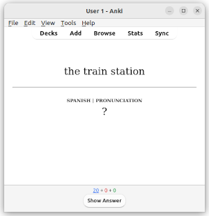
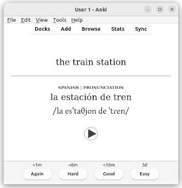

# AnkiLangs

The aim of this project is collaborating in the creation of high quality, free
and open source Anki decks for language learning. Check the website for more
details [AnkiLangs.org](https://ankilangs.org).

AnkiLangs is not part of nor necessarily endorsed by Anki (https://apps.ankiweb.net/).

This is a [monorepo](https://en.wikipedia.org/wiki/Monorepo) containing everything.

_Example card to learn Spanish as an English speaker. Question side and answer side._

Find more [screenshots](https://ankilangs.org/docs/screenshots/) on the website.

## Try it out

See [here](https://ankilangs.org/) for instructions and to download decks to
try yourself.

## Contributing

Translations, corrections and improved audio are much appreciated! Have a look at our [instructions for contributors](CONTRIBUTING.md).

## Development

If you are technically more experiences and want to contribute to this project you can have a look at the [development.md](docs/development.md).
