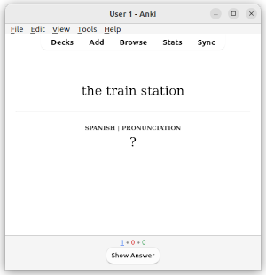
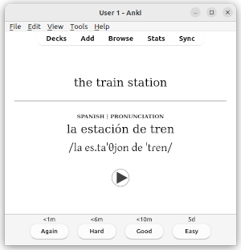

# AnkiLangs

The aim of this project is collaborating in the creation of high quality, free
and open source Anki decks for language learning. Check the website for more
details [AnkiLangs.org](https://ankilangs.org).

AnkiLangs is not part of nor necessarily endorsed by Anki (https://apps.ankiweb.net/).

This is a [monorepo](https://en.wikipedia.org/wiki/Monorepo) containing everything.




_Example card to learn Spanish as an English speaker. Question side and answer side._

Find more [screenshots](https://ankilangs.org/docs/screenshots/) on the website.


## Try it out

See [here](https://ankilangs.org/) for instructions and to download decks to
try yourself.


## Contribute changes

Both code contributions
and audio from (as good as) native speakers are highly appreciated!
Have a look at our [instructions for contributors](CONTRIBUTING.md).

## Build

If you want you can build the decks (i.e. convert the CSV files into Anki decks).
Note that you do not need to do this in order to make a contribution. If you want to improve a deck
you can stick to the "Contribute changes" section above and leave the complicated stuff to us 🙂.

To build the decks you need the following:

* Python 3 ([Installation](https://wiki.python.org/moin/BeginnersGuide/Download)).
* Poetry ([Installation](https://python-poetry.org/docs/#installation)).
* Anki ([Installation](https://apps.ankiweb.net/#download)).
* Within Anki the [CrowdAnki add-on](https://ankiweb.net/shared/info/1788670778) (code 1788670778).
  [Add-on installation](https://docs.ankiweb.net/addons.html).

```bash
poetry install
poetry run al-tools generate -i src/data/
poetry run al-tools check -i src/data/
poetry run brainbrew run recipes/source_to_anki_minimal_pairs.yaml
poetry run brainbrew run recipes/source_to_anki_625_words.yaml
```

Open Anki and via `File / CrowdAnki: Import from disk` import any of the `build/` subdirectories of this
Git repository.

Then you may review them like any deck.


### To create a new 625 words deck

* Copy and adapt one of the directories in `src/note_models/`

```bash
# Probably leave the following unchanged
export AL_SRC_NAME="en_to_pt"
export AL_SRC_NAME_2="EN to PT"
export AL_SRC_LANG_NAME="Portuguese"
export AL_SRC_LISTENING="Listening"
export AL_SRC_PRONUNCIATION="Pronunciation"
export AL_SRC_READING="Reading"
export AL_SRC_SPELLING="Spelling"

# CHANGE ME!
export AL_DST_NAME="de_to_fr"
export AL_DST_NAME_2="DE to FR"
export AL_DST_LANG_NAME="Französisch"
export AL_DST_LISTENING="Listening"
export AL_DST_PRONUNCIATION="Pronunciation"
export AL_DST_READING="Reading"
export AL_DST_SPELLING="Spelling"
## Use the following if the source language is not EN
#export AL_DST_LISTENING="Hörverständnis"
#export AL_DST_PRONUNCIATION="Aussprache"
#export AL_DST_READING="Leseverständnis"
#export AL_DST_SPELLING="Rechtschreibung"


cp "src/headers/description_${AL_SRC_NAME}-625_words.html" \
  "src/headers/description_${AL_DST_NAME}-625_words.html"

cp -r "src/note_models/vocabulary_${AL_SRC_NAME}" \
  "src/note_models/vocabulary_${AL_DST_NAME}"

sed -i "s/id: .*/id: `python3 -c "import uuid; print(uuid.uuid4())"`/" \
  "src/note_models/vocabulary_${AL_DST_NAME}/note.yaml"

find "src/note_models/vocabulary_${AL_DST_NAME}/" -type f \
  -exec sed -i "s/${AL_SRC_NAME}/${AL_DST_NAME}/g" {} +

find "src/note_models/vocabulary_${AL_DST_NAME}/" -type f \
  -exec sed -i "s/${AL_SRC_NAME_2}/${AL_DST_NAME_2}/g" {} +

find "src/note_models/vocabulary_${AL_DST_NAME}/" -type f \
  -exec sed -i "s/${AL_SRC_LANG_NAME}/${AL_DST_LANG_NAME}/g" {} +

find "src/note_models/vocabulary_${AL_DST_NAME}/" -type f \
  -exec sed -i "s/| ${AL_SRC_LISTENING}/| ${AL_DST_LISTENING}/g" {} +

find "src/note_models/vocabulary_${AL_DST_NAME}/" -type f \
  -exec sed -i "s/| ${AL_SRC_PRONUNCIATION}/| ${AL_DST_PRONUNCIATION}/g" {} +

find "src/note_models/vocabulary_${AL_DST_NAME}/" -type f \
  -exec sed -i "s/| ${AL_SRC_READING}/| ${AL_DST_READING}/g" {} +

find "src/note_models/vocabulary_${AL_DST_NAME}/" -type f \
  -exec sed -i "s/| ${AL_SRC_SPELLING}/| ${AL_DST_SPELLING}/g" {} +
```

Edit the deck description file:

```bash
vim "src/headers/description_${AL_DST_NAME}-625_words.html"
```

To generate new UUIDs you can use this command:

```bash
python3 -c "import uuid; print(uuid.uuid4())"
```

Edit `recipes/source_to_anki_625_words.yaml`:
* Add the new source files under `generate_guids_in_csvs`
* Copy a block under `note_models_from_yaml_part` and:
  * Edit the `part_id` and `file`
* In the `headers_from_yaml_part` section copy a block and:
  * Edit the `part_id`
  * Edit the `name`
  * Replace `crowdanki_uuid` with a new UUID
  * Set the path of the `deck_description_html_file`
* In the `notes_from_csvs` section copy a block and:
  * Adapt all strings to the new language
* Copy a `generate_crowd_anki` section and replace all strings with the new
  language

Create the new CSV files you need under `src/data/` by copying and adapting
existing files. Note that the `guid` columns must stay empty since they have
to be unique and will automatically be generated during build.


### Generate Audio files

You need a Google Cloud account and need to be
[authenticated](https://cloud.google.com/docs/authentication/set-up-adc-local-dev-environment).

Then execute, for example:

```bash
poetry run al-tools audio -i src/data/625_words-base-de_de.csv -o src/media/audio/de_DE/
poetry run al-tools audio -i src/data/625_words-base-pt_pt.csv -o src/media/audio/pt_PT/
poetry run al-tools audio -i src/data/625_words-base-it_it.csv -o src/media/audio/it_IT/
poetry run al-tools audio -i src/data/625_words-base-fr_fr.csv -o src/media/audio/fr_FR/
poetry run al-tools audio -i src/data/625_words-base-en_us.csv -o src/media/audio/en_US/
poetry run al-tools audio -i src/data/625_words-base-es_es.csv -o src/media/audio/es_ES/
```


## Release

To release a deck do the following:

* Update the version in the `src/headers/description*` file
* Build as described above
* Update the version in the `src/headers/description*` file to the next dev version
* Import the deck into Anki
* Export from Anki:
  * Include media
  * Support older Anki versions
* Rename the exported deck so it ends with the version e.g. `- 0.0.1`
* Add a new Git tag
* Create a release on GitHub with the exported deck
* Update the README and website with download links
