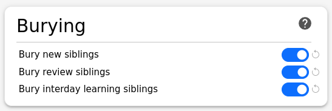

# Learning Tips

## Study Tips

- **Study consistently**: Daily practice is more effective than long, infrequent sessions
- **Speak out loud**: For pronunciation cards, always speak the answer aloud
- **Use the audio**: Listen carefully to native pronunciation on all audio-enabled cards
- **Don't rush**: Take time to recall the answer before revealing it
- **Be honest**: Mark cards as "Again" if you couldn't recall the answer quickly

## Adjusting Deck Options

Avoid learning too many new cards per day because it might quickly become overwhelming.
The default value of **New cards/day** of 20 is a good start.

We strongly encourage you activate **burying** to make your learning most efficient.
Otherwise you may for example be asked to do _Reading_ for a word that you just
completed _Pronunciation_ for, which makes it too easy. This would hurt your long term
progress since a few weeks later you no longer have the _Pronunciation_ context
and will fail. Also in real-life situations when you need to read a word you lack
that context.

Enabling **FSRS** (Free Spaced Repetition Scheduler) is also a good idea because
it calculates more optimal review intervals.

See [Anki's documentation](https://docs.ankiweb.net/) for detailed settings guidance.

## Card Types

Most AnkiLangs decks use four complementary card types to help you master vocabulary:

### Pronunciation
See the source language word and speak the target language word aloud. Focus on accurate pronunciation.

### Listening
Hear the target language word and recall its meaning in the source language. Trains your listening comprehension.

### Reading
See the target language word and recall its meaning in the source language. Trains your reading comprehension.

### Spelling
See the source language word, hear the target language pronunciation, and type the target language word. Reinforces spelling and combines reading with listening.

## Minimal Pairs Decks

For minimal pairs decks specifically:

- **Listen carefully**: Focus on the subtle differences between the sounds
- **Repeat out loud**: After revealing the answer, practice speaking both words
- **Use the audio repeatedly**: Play each audio multiple times if needed
- **Practice regularly**: Daily short sessions are more effective than long, infrequent ones
